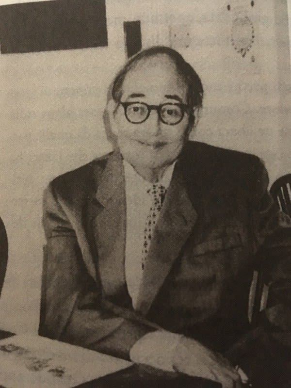
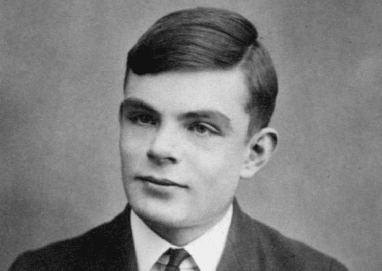

## 向默默无闻的密码专家们致敬

我总是极其喜欢那些在历史上虽然去世后才受到人们赞誉，但他们在某些领域却表现出卓越的人物。我之所以喜欢他们，原因有两点：第一，这些人确实在某些领域表现出色，值得我们学习；第二，尽管他们在当时并不为人所知，但他们却为世界做出了杰出的贡献。

巴贝奇、艾利斯、图灵就是这种人。

### 查尔斯·巴贝奇：密码学的先驱

在计算机领域的历史中，查理·巴贝奇（Charles Babbage）被誉为计算机科学的奠基人之一。他的贡献和成就对于现代计算机的发展起到了决定性的作用。

巴贝奇于1791年12月26日出生在英国伦敦，是伦敦银行家本杰明·巴贝奇(Benjamin Babbage)的儿子，由于他的婚事没有得到父亲的赞同，导致他与家族财富无缘，但他仍有有足够金钱，不至于出现财务问题。

他早年显示出对机械设备和数学的极大兴趣。他的天赋在年轻时就显露无疑，使他获得了剑桥大学的奖学金。巴贝奇真正的突破在于他对机械计算设备的思考和设计。他最著名的发明是分析机（Analytical Engine），它被认为是世界上第一台通用计算机的雏形。分析机的概念包括了计算、存储和控制三个基本组件，它使用轮齿和齿轮系统来进行计算和数据处理。

尽管分析机从未在巴贝奇的时代得以完全实现，但它对计算机科学的发展产生了深远的影响。巴贝奇的思想和设计为后来计算机的制造和发展提供了重要的指导，并对图灵机的提出起到了关键作用。图灵在巴贝奇的基础上提出了图灵机的概念，进一步推动了计算机科学的发展。巴贝奇的遗产也在现代计算机的设计和原理中得到了体现，他被视为计算机科学领域不可或缺的重要人物。

除了对计算机科学的贡献，巴贝奇在密码学领域也有重要的成就。他成功破解了维吉尼亚密码，这是密码分析领域最伟大的突破。不可思议的是，巴贝奇并不是靠什么复杂的机械装置或者复杂运算，他使用的是他那颗灵活的脑袋。

可惜的是巴贝奇并没有发表这个巨大的贡献，具体原因不详，有可能是因为他懒散的原因，他的确有把计划做完的坏习惯；也有可能是英国情报局要求巴贝奇将这项成就保密，若是真的这倒符合为了国家安全对密码学的成就进行保密的悠久传统。

### 詹姆斯·艾利斯：现代密码学的奠基人

詹姆斯·艾利斯（James Henry Ellis）是密码学领域的一位杰出人物，他的工作为信息安全和现代密码学的发展做出了突出的贡献。

艾利斯出生于英国伦敦，他在剑桥大学学习数学和物理，并在军队中的情报部门开始了他的职业生涯。在那里，他对通信保密和密码学的重要性产生了浓厚的兴趣。

1969年，艾利斯成为英国政府通信总部（GCHQ）的一员，他被选中参与一个秘密项目，这个项目最终导致了一种被称为公钥密码学的革命性技术的出现。在那个时代，密码学的主流思想是使用相同的密钥进行加密和解密，但这种方法存在着密钥安全分发的问题。

艾利斯与同事克里夫·库肯（Clifford Cocks）独立地提出了一种公钥密码的思想，其中加密和解密使用不同的密钥。他们的目标是实现安全的通信，而无需传输私密的密钥。这种新颖的思想引起了人们的兴趣，但出于国家安全的考虑，他们的工作在当时并未公开。

守密了将近30年后，艾利斯和他的同事考克斯和威廉森终于获得他们应得的赞赏。在1997年，当公钥密码学的概念被独立地提出和发展时，他们的工作被公开并得到广泛认可。艾利斯的贡献被视为公钥密码学的先驱之一。

然而，可惜的是，艾利斯在1997年11月25日早了一个月去世，享年73岁。他没有亲眼见证自己的工作对密码学的重要影响以及对信息安全的贡献。

尽管艾利斯的贡献在很长一段时间里没有得到公开的承认，但他的工作为密码学的发展和信息安全的提升奠定了基础。公钥密码学的广泛应用成为当今数字世界中保护隐私和数据安全的重要工具。

如果你通过搜索引擎在互联网查找公钥加密系统相关文章，最先看到的是迪菲-黑尔曼-墨克钥匙交换法，只有少数网页提到他和他的同事。他的同事考克斯对此的态度是：“想公开获得赞扬，就不会来做这份工作。”威廉森显得同样冷静：“我的反应是‘好的，人生就是如此。’基本上，我还是继续过我的生活罢了。

有意思的是当卫德费·迪菲，也就是公钥密码概念的发现者之一通过NSA知道艾利斯才是公钥密码的最早发明人，他们之间的对话也是让人敬佩:

>迪菲和艾利斯什么都聊，从考古学一直到木桶里的老鼠如何改进苹果汁的味道，可是每当他们的对话慢慢漂向密码学时，艾利斯就会和缓地改变话题。就在迪菲必须结束这趟拜访，准备离开时，他再也忍不住而直接对艾利斯提出藏在他心里的问题：“告诉我，你们是怎么发明公开钥匙加密系统的？”踌躇很久后，艾利斯低声说道：“呃，我不知道我能谈多少。且允许我这么说吧，在这方面你们做的比我们多多了。

詹姆斯·艾利斯虽然在生前未能看到自己的成就得到广泛认可，但他的工作为密码学的进步铺平了道路，影响深远。他是密码学领域一位杰出的先驱，他的贡献将继续在信息安全领域发挥重要作用。

### 阿兰·图灵：破译恩尼格玛，改变密码学历史

阿兰·图灵（Alan Turing）是二十世纪最伟大的数学家和密码学家之一。他的贡献不仅奠定了现代计算机科学的基础，还改变了密码学的历史。图灵于1912年6月23日出生在英国伦敦。他在英国出生和成长，在早年展现了卓越的数学才华。图灵的父亲是一名英国政府官员，而他的母亲则是贵族血统的成员，这些背景为他接受良好教育提供了机会。

根据历史记录，图灵在Sherborne School接受了中学教育，随后进入了剑桥大学，成为了金斯学院（King's College）的学生。他于1934年进入剑桥大学学习数学，并在数学领域取得了卓越的成绩。尽管他最著名的成就之一是在第二次世界大战期间破译了德国的恩尼格玛密码，但他在密码学领域的工作远远超出了这一壮举。

恩尼格玛密码是当时德国广泛使用的一种复杂的电子密码机。它的设计极其精巧，采用了机械和电路结构，具备极高的加密强度。然而，图灵和他的团队经过艰苦的努力，成功地攻克了这个看似无懈可击的密码系统。他们的突破离不开一台名为"巴贝奇"（Bombe）的机械装置，该装置利用穷举搜索和密码分析技术，逐渐还原了恩尼格玛密码的加密密钥。这一成就不仅在战争中对盟军起到了决定性的作用，同时也对密码学的进一步发展产生了深远的影响。

图灵的破译工作向世人展示了密码学的潜力和重要性。他开创性地提出了一种基于数学和逻辑的密码分析方法，这一方法为密码学研究提供了全新的思路。图灵的成就不仅体现在他成功破解了恩尼格玛密码，更在于他的密码分析技术和思想为密码学领域树立了新的范式。

除了破解密码，图灵还对密码学的理论和实践做出了重要的贡献。他在密码机设计和密码系统的安全性方面提出了许多关键的概念和原则。图灵强调了密码系统的安全性应该建立在算法的保密性之上，而非依赖于保密密钥的安全传输。这一思想为后来的密码学发展指明了方向，促进了公钥密码学的兴起。

然而，图灵的生命并不像他的成就一样辉煌。战后，他因为同性恋身份遭受到社会的歧视和迫害。英国政府对他实施了苛刻的监控，并迫使他接受荷尔蒙治疗。这种不公正的对待给图灵带来了极大的伤害，最终导致了他的早逝。直到近年来，英国政府才正式向图灵道歉，肯定了他在战争中的贡献和他对计算机科学的重要影响。

图灵是一个伟大的人物，他的思想和贡献对现代密码学和计算机科学领域产生了深远的影响。他的破译成就不仅帮助盟军取得了战争的胜利，也为密码学的未来发展奠定了坚实的基础。他的故事提醒我们，科学的进步离不开创新思维和勇于突破传统边界的精神。

阿兰·图灵是一个真正的先驱者，他的贡献将永远被铭记在密码学和计算机科学的历史中。

------

[上一章节](charpter01_unlocking_cryptography02.md) [下一章节](charpter01_unlocking_cryptography04.md)   

