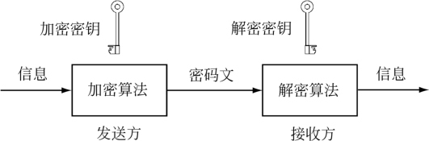

### 基本原理

理解了基础数学知识，我们就可以开始探索密码学的奥秘了。本章节只介绍了一些基本原理。如果你对这些原理感兴趣，想要更深入地了解密码学，国内大学的密码学书籍就是个不错的选择。你会发现，这些书籍充满了神奇和刺激，让你能够更深入地了解密码学的奇妙世界，提升你的知识水平。

密码学中有两类加密算法，分别是对称加密和非对称加密。我们可以将加密理解为家里的保险箱。对称加密与我们生活中的概念是一样的，使用同一把钥匙对保险箱进行上锁、开锁。非对称加密与我们日常生活不太一样，是用一把钥匙上锁后，用另外一把不同的钥匙来开锁。下图是一个加密解密的示意图。

