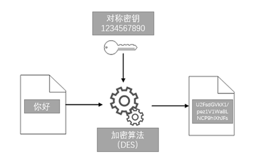
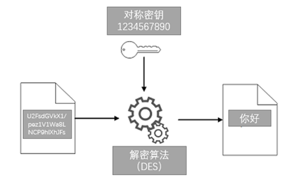
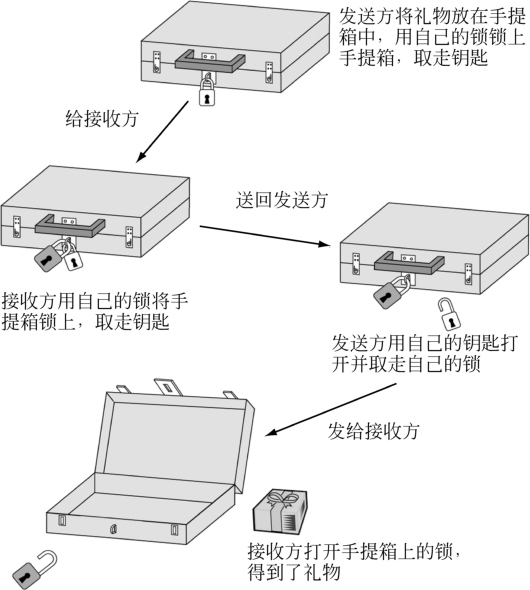

### 基本原理

理解了基础数学知识，我们就可以开始探索密码学的奥秘了。本章节只介绍了一些基本原理。如果你对这些原理感兴趣，想要更深入地了解密码学，国内大学的密码学书籍就是个不错的选择。你会发现，这些书籍充满了神奇和刺激，让你能够更深入地了解密码学的奇妙世界，提升你的知识水平。

密码学中有两类加密算法，分别是对称加密和非对称加密。我们可以将加密理解为家里的保险箱。对称加密与我们生活中的概念是一样的，使用同一把钥匙对保险箱进行上锁、开锁。非对称加密与我们日常生活不太一样，是用一把钥匙上锁后，用另外一把不同的钥匙来开锁。下图是一个加密解密的示意图。

为了使读者方便理解本书内容，从本章节开始，我们以孙红雷主演的《潜伏》中余则成、翠平和李涯三个人物创建一个密码应用场景，其中余则成是情报的发送者，翠平是情报的接收者，李崖则是窃听者，一心想要获取余则成是共产党的证据。

#### 对称加密

所谓的对称加密其实就是加密和解密使用了相同的密钥。

为了方便理解。我以DES算法为例介绍一下整个加解密的过程。下图中我们使用了密钥“1234567890”将明文数据“你好”加密成密文“U2FsdGVkX1/pez1V1Wa8LNCP9hlXhJFs”，紧接着我们使用密钥“1234567890”将密文“U2FsdGVkX1/pez1V1Wa8LNCP9hlXhJFs”进行解密得到明文“你好”。这个例子中加密密钥和解密密钥都是“1234567890”，因此被称为对称加密。

让我们先回到故事里。余则成想将情报发送给翠平，为了防止李崖窃听，余则成每次都需要将情报使用不同的密钥对情报进行加密，但这里面临的问题就是余则成必须把密钥安全的传送给翠平，否则翠平就没有办法阅读这些情报。

余则成和翠平约定每周见一次面，给翠平一个星期的密钥。虽然这样传递密钥很安全，但是这也增加了密钥传送的成本，中间万一有人生病，这个系统就面临中断。余则成想到的另外一个方法是在特殊情况下，雇佣一个人在他们之间进行密钥传递，虽然这个方法存在一定的安全隐患，但至少可以保证他们这对情侣之间情报传递不中断。

上面的场景中，不管使用上面那种方法，密钥必须安全传送，这个动作无论如何都省不了，这就是对称密钥的缺点。两千多年的时间里，这个被视为密码学的真理。

#### 非对称加密

这时候，马丁·黑尔曼(Martin Hellman)、卫德费·迪菲(Whitfield Diffie)、拉尔夫·墨克(Ralph Merkle)三个“傻瓜”登场了，他们经过无数次的尝试貌似找到了解决密钥传送的答案。

我们还是回到余则成和翠平的故事里。有一天余则成突发奇想，如果把情报放到一个铁盒子里，再加上一把非常安全的锁头。每次发送情报的时候，让身边一个可靠的人将这个铁盒子送给翠平。由于翠平没有余则成的钥匙，所以这时候她不用打开铁盒子，只需在铁盒子上加上自己的锁头，然后让人把铁盒子再寄给余则成。当余则成收到这个铁盒子的时候，铁盒子上已经挂了两把锁，余则成拿出自己的钥匙把之前自己的锁打开，只留下翠平的锁头，再让人把铁盒子送给翠平。神奇的事情发生了，这时候铁盒子上只挂着翠平的锁头，所以她可以用自己的钥匙打开铁盒子顺利拿到情报。

虽然上面的故事比较粗糙，但上面的故事给了我们新的启示，加密信息不一定非得交换密钥。

但计算机实现时，这里有一个顺序的问题。加密和解密的顺序必须遵循“后上先下”的原则，也就是说最后一个加密的应该第一个先解开。上面的故事里，翠平是最后一个加锁，按照计算机的执行顺序应该先让翠平先打开锁头，但余则成先打开了自己的锁头。这个“先上先下”的原则不符合计算实现的要求。

尽管上面的构想没有办法通过计算机实现，但迪菲和黑尔曼他们这两个难兄难弟也算是在黑暗中看到了一点微弱的亮光。

经过无数次的折腾，迪菲和黑尔曼最终把注意力集中在了单项函数上。黑尔曼的构想建立在Y^x(mod P)的单向函数上，毫不夸张的说现代密码学就是建立在这个数学公式的基础上。基于单项函数上面的故事需要重新改写。

新的故事的前提是余则成和翠平先得协商好Y和P的值，而且Y必须大于P。假如协商的数字是7和11，那么函数的表达方式就是7^x(mod 11)。这两个值不需要保密，双方可以通过电话进行通讯，即使李崖通过电话线窃听到了这两个数字也没有关系（终于不用铁箱子这种笨重的解决方案了）。为了把这个新的故事讲清楚，我们把余则成和翠平的故事拆分成以下四步：

第一步，挑选各自的秘密数字。余则成挑选一个秘密数字，例如2，用字母A表示；翠平也挑选一个数字，例如3，用字母B表示；

第二步，把各自挑选的秘密数字套入单项函数进行计算。余则成把2套进单项函数里，计算后结果是7^2(mod 11) =5，用字母A1表示；翠平把3套进单项函数里，计算结果是7^3(mod 11) =2,用字母B1表示；

第三步，交换各自单项函数的计算结果，也就是互换A1和B1。余则成把单项函数运算后的结果5传送给翠平，翠平把单项函数运算后的结果2传送给余则成；

采用单项函数后，余则成和翠平通过电话方式互换A1和B1，即使李崖采用窃听的方式拿到这些数字也丝毫不影响系统的安全性，因为这两个数字根本就不是加密密钥。实际上，如果余则成和翠平交换的数字足够大，李崖几乎没有可能通过A1和B1推导出A和B这两个秘密数字，这就是单项函数的魅力。

第四步，余则成用翠平给的B1来计算B1^A(mod 11)=2^2(mod 11)=4 ，翠平用余则成给的A1来计算A1^B(mod 11)=5^3(mod 11)=4

奇迹发生了，余则成和翠平得出了同样的数字4，密钥协商成功。接下来，他们夫妻俩就可以使用协商的密钥进行情报加密了。

对非对称密钥的原理，颜色是我目前看到的最好的类比。一方面颜色的混合除了和化学相关，也和数学息息相关。

颜色混合涉及到光的三原色理论和颜色空间。光的三原色是红色、绿色和蓝色，它们可以按不同的比例混合以产生其他颜色。在颜色空间中，不同颜色可以用数学模型表示，例如RGB（红、绿、蓝）模型或CMYK（青、品红、黄、黑）模型。通过调整不同颜色的光的强度和比例，可以实现颜色的混合和生成新的颜色。

颜料的混合是一个复杂的过程，实际混合效果可能因多种因素而有所差异。

另一方面，颜色混合也具有单项函数不可逆的特征。

一般情况下无法简单地将混合后的颜色分解回混合前的颜色成分。颜料的混合过程是一个不可逆的过程，颜料吸收和反射的光波长发生了变化。因此，分解混合后的颜色成分通常是非常困难的，特别是在颜料的混合比例和具体颜色成分不清楚的情况下。

为了让大家更好的理解非对称加密的原理，我们以颜色作为密钥。假设余则成、翠平和李涯每个人手里都有一个调色板，里面装着一升的黄色。如果余则成和翠平想协商一个密钥，他们俩可以将各自独有一升颜料加入到调色板中，比如余则成加了红色颜料，翠平加了紫色颜料。接着他们互换调色板，在对方的调色板里加入自己一升独有配方的颜料，最终他们俩都拥有同样颜色的调色板。因为这个过程在各自的调色板里都含有一升的黄色、红色和紫色，虽然余则成和翠平都不知道对方颜料具体的颜色，但是他们最终得到了相同的颜色的调色板，这个就是他们用来加密情报的密钥。李崖虽然可以看到双方交换的调色板，但是由于颜色混合后发生了化学反应，所以他也没有办法搞明白余则成和翠平的加入的颜料，更没有办法搞明白最终调色板的颜色，也就是余则成和翠平协商的密钥。在这个例子里颜料的混合与单项函数非常相似。

到此我们先离开故事，回到历史。1976年在《密码术的新方向》中，迪菲和黑尔曼提出了一种可以利用密码术产生手写签名的电子等效物的方法。这篇文章的影响无论给予多高评价都不为过。迪菲-黑尔曼-墨克钥匙交换方案(Diffie-Hellman-Merkle key exchange scheme)让双方可以透过公开的讨论，建立秘密通讯。它是科学史上最反直觉的发现，它迫使所有密码组织重写加密规则。