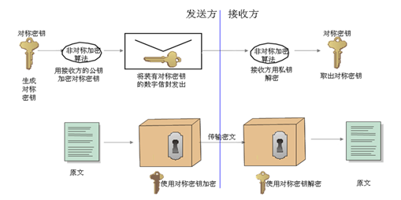

####  RSA算法

1976年，美国的密码学家迪菲（Diffie）、赫尔曼（Hellman）和墨克（Merkle）说服了密码界，让大家相信密钥的交换有更好的办法——这就是非对称加密，遗憾的是他们没有找到可以实现非对称密钥的特殊单项函数。

非对称加密和对称加密不同的是加密密钥与解密密钥不同。在非对称加密中，每个用户都有一对密钥，一个公钥和一个私钥。公钥可以在对外发布，而私钥则则必须保密。当两个用户想要进行私密通信时，他们可以使用公钥加密消息，然后使用私钥解密。反过来，如果使用自己的私钥对数据加密，用公钥进行解密，我们称为签名。非对称加密一个重要应用是数字签名，它可以提供等同于书面签名的功能，而且受《中华人民共和国电子签名法》保护。

虽然迪菲（Diffie）、赫尔曼（Hellman）和墨克（Merkle）没有实现，但在五千公里外的美国东岸，麻省理工学院的瑞维斯特（Ronald Rivest）、薛米尔（Adi Shamir）和艾多曼（Leonard Adleman）在1997年提出了第一个公钥加密算法RSA（三个人英文名字的首字母）。

瑞维斯特他们找到的单项函数就是基于大质数分解困难的原理。假如使用的质数是P=9，967、q=9，239，这两个数相乘结果是9，967*9，239=92,085,113=N。这里的N就是公钥，可以对外公开。如果N值是翠平的公钥，那么P和q就是翠平的私钥，余则成就可以使用N值对情报进行加密，由于N是大质数没人能够通过N值获得翠平的私钥（P和q），也就是说P和q是翠平的私钥，只有翠平可以解密情报信息。

RSA的厉害之处就是如果N值足够大，几乎没有人可以通过N值推算出P和q，这正是RSA非对称算法最简洁漂亮的一面。

值得注意的是，随着计算机运行速度越来越快，RSA算法的安全性也受到了威胁，目前采用2048位RSA算法才能保证算法的安全性。

####  数字信封

虽然RSA可以完美的传递密钥，但相对DES对称加密算法，RSA的加解密的效率还是太低。

实际应用中会采用数字信封技术对数据进行加密。数字信封技术是用对称加密算法对明文数据进行加密，用非对称加密算法对对称密钥进行加密，这样既可以提升加密效率，又可以有效保护数据安全。

数字信封技术主要包括数字信封打包和数字信封拆解两个过程。数字信封打包指的是信息发送方采用对称密钥加密信息原文，然后使用接收方公钥加密对称密钥，之后将密钥和密文一起发送给接收方。数字信封拆解指的是接收方先用对应的私钥打开数字信封，得到对称密钥，然后使用对称密钥解开加密信息得到明文数据。

让我们再次请出余则成和翠平这对革命夫妻。余则成给翠平传递情报时，这次废弃了直接用对称密钥加密情报的方式。余则成先用对称密钥加密情报内容，为了不再像以前那样每个星期都要交换一次密钥。由于非对称密钥的公钥是对外公开的，余则成就可以先从一个公开的地方获取翠平的公钥，然后使用翠平的公钥加密对称密钥，最后将两样东西：用对称密钥加密后的情报，以及用非对称密钥加密的对称加密密文发送给翠平。翠平在接收到这两样东西后，先用自己的私钥解密出对称密钥，再用对称密钥解密加密的情报。虽然这个过程略显复杂，但由于采用对称密钥进行情报加密，所以加密情报的效率却得到了极大的提升，同时由于使用了非对称密钥进行对称密钥的保护，也省去了每周交交换密钥的必要，并最大程度上提高了情报传递的安全性。

------

[上一章节](charpter02_understanding_cryptography03.md) [下一章节](charpter02_understanding_cryptography05.md)   