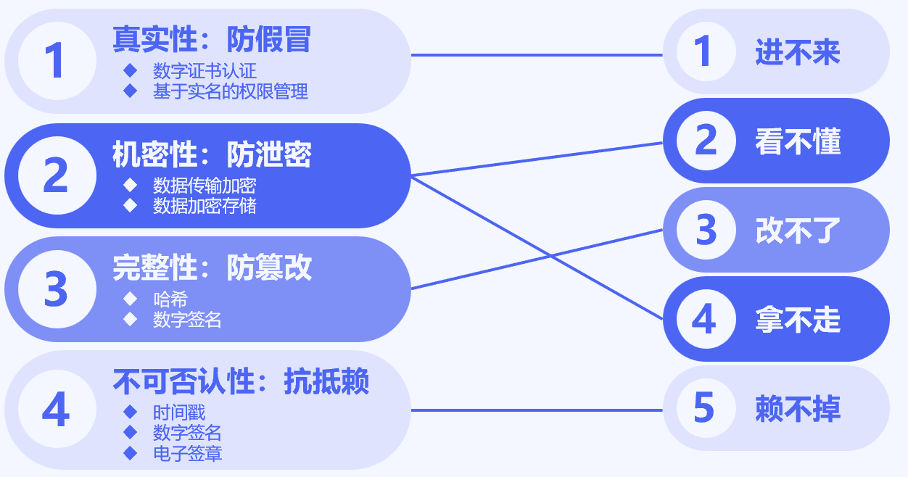

本章节我们主要遵循国家密码管理局相关规范，结合我自己多年工作经验进行密码系统的设计和实施。要将国产密码在各个领域使用起来，一方面要符合国密规范，尤其是密钥管理的规范；另一方面，我们需要考虑到应用场景的复杂性，这对于密码系统的设计要求极高。

## 密码的功能

密码是保障网络空间安全的核心技术，也是赋能数字经济发展的核心技术和基础支撑。使用国产密码算法按照国密规范进行身份认证、信息加密、数字签名就是建立一种主动防御安全防护系统，使得攻击者进不去，获取机密信息也看不懂。

### 数据的机密性

现实生活中，要保证文件的机密性，一般采用加装保护措施、增加警卫人员、藏匿或伪装等方式，这些方法不仅投入成本高，而且存在很多人为风险。

数字世界中，使用密码对数据加密，即使攻击者拿到密文，由于采用了密码算法进行数据加密，攻击者也解不开、看不懂。通过密码技术对数据进行加密，可以确保敏感数据在传输和存储过程中不被未经授权的人访问。这样可以有效防止信息泄露和窃取，保护系统的安全性和可靠性。

常见场景就是超文本传输安全协议（Hypertext Transfer Protocol Secure，HTTPS）。当我们在访问网站时，在地址栏我们会看到一个锁形的图标类似https://www.xxx.com这样的地址，这里面的HTTPS其实就是密码学的应用。采用HTTPS的网站就是使用密码在我们的电脑和网站之间建立了一个安全的通讯隧道，可以有效防止黑客窃听我们的敏感信息（比如系统登录的口令、购物时绑定的银行卡信息等）。

### 数据的完整性

现实生活中，要保证数据的完整性，一般采用签字、盖章、水印等方式。对于内容较多的文件则采用“骑缝章”，保证页面内容不会丢失或者被替换，采用水印技术保证文件不被篡改。

对于电子文件使用密码可以实现数据的完整性，确保数据在传输和存储过程中没有被篡改或损坏。具体实现方式是采用哈希算法（比如SM3、SM3 MAC、SM4 MAC等）对数据进行计算得到一个哈希值（摘要）。由于哈希值具有唯一性，有点类似我们的指纹，所有也被称为数字指纹。不同文件采用哈希算法会生成不同的摘要，一旦文件被篡改，生成的摘要会不同。要想检查文件是否被修改，只需将新的摘要和原来的摘要进行对比，如果两个摘要相同，文件就没有改动，反之则证明文件已经被篡改。

常见使用场景就是我们在官网上下载软件，一般情况下软件都会附有一个哈希值，我们可以用工具对下载的文件进行哈希计算，如果哈希值和官网的哈希值一致，就代表文件没有被篡改，否则文件中可能被植入木马，这时候就要谨慎使用了。

### 身份的真实性

现实生活中，我们可以通过身份证、相貌、指纹、声音等方式确认人的身份，但在网络环境中，身份信息和信息来源很容易伪造，尤其是以ChatGPT为首的人工智能（Artificial Intelligence，AI）的快速发展，使得数字世界面临更多潜在风险和挑战，其中之一就是人工智能在伪造身份方面已经崭露头角。

密码作为保障网络安全的核心技术，在身份识别方面发挥着重要作用。密码技术提供了一种可靠的方式来确认用户身份和信息的真实性，确保信息来源可靠，没有被伪造和篡改。

对于参与系统使用的人员，使用数字证书（公钥）和私钥，可以确保只有授权人员才能访问系统，从而确保身份的真实性。其中原理就是采用了非对称加密私钥签名公钥验签的机制，由于私有只有自己持有，如果验签成功就可以确保用户的身份的真实性，这种机制也可以确保信息来源的可靠性。

常见的应用场景就是网银使用的U盾。U盾是一种类似优盘的硬件，通常由芯片、加密算法和存储器组成。用户可以将私钥等敏感数据存储在U盾中，以保护这些数据的机密性和完整性。在进行身份认证或数字签名等操作时，需要插入U盾并输入密码，才能进行相关操作。U盾通常具有防篡改、防病毒等安全特性，可以有效保障用户的身份和数据安全。

### 行为的不可否认性

现实生活中，我们的行为会受到一定约束，而且很容易留下蛛丝马迹，如果发生纠纷就会被用来作为证据。比如甲乙双方签订合同，他的签字就可以作为法律证据。但在网络上签订的合同，怎样防止抵赖？

正如前面讲到的非对称加密除了双方不用交换密钥之外，还可以产生与手写签名等价的方法。为了使得电子签名和实际生活中的签名一致，对于一些需要人参与的文件，一般采用电子签章。电子签章是将数字证书与图片或者文字进行绑定，实现数字签名的可视化操作。

需要特别注意的早在2004年电子签名就得到了《中华人民共和国电子签名法》的法律保障。通过使用数字签名，可以确保交易的真实性和不可否认性，这对于保护交易的公正性和可追溯性至关重要，在法律和商业领域具有重要意义。

## 密码的作用

密码在网络和信息安全方面起着重要的作用。它直接关系到国家政治安全、经济安全、国防安全和网络安全，也直接关系到公民、法人和其他组织的合法权益。在网络空间安全防护中发挥着重要的基础支撑作用，是维护网络安全最有效、最可靠、最经济的技术手段。通俗来讲，密码的作用可概括为三个方面。

第一，密码是“基因”，密码是网络安全的核心技术和基础支撑。密码可以保护网络中的信息不被泄露、内容不被篡改、身份不被冒充，还可以抵抗否认行为等。它满足了网络和信息系统对保密性、完整性、真实性和不可否认性等安全需求。密码就像网络免疫系统的内置基因，是实现网络从被动防御到主动免疫的关键因素。如果没有密码，就无法真正解决网络安全问题。

第二，密码是“信使”，是构建网络信任体系的重要基石。信任是任何价值物转移、交易、存储和支付的基础，也是社会发展的润滑剂和推动力。在信息时代，万物互联、人机互认、天地一体，网络空间的信任至关重要。密码算法和协议可以解决人、机、物的身份标识、身份验证、统一管理、信任传递和行为审计等问题，是实现安全、可信、可控的互联互通的核心技术手段。密码在网络空间传递价值和信任方面扮演着重要的角色。

第三，密码是"卫士"，被认为是国家的重要战略资源，与核技术和航天技术并列为国之三大"杀手锏"技术。近年来，我国在密码算法设计和分析能力方面取得了国际先进水平。我国自主设计的商用密码算法ZUC、SM2、SM3和SM9已成为国际标准。密码无处不在，时刻守护着国家、公民、法人和其他组织的安全。如果将网络和信息系统比作大楼，密码就像是看门卫士。如果没有卫士或者雇佣了"小偷"来看门，就等于大门敞开，没有任何安全可言。

随着信息化的快速发展，万物互联成为趋势，信息孤岛逐渐消除，密码在保护国家安全、促进经济社会发展、保护公民合法权益和个人隐私等方面的重要性和战略地位将更加突出。合规、正确、有效地使用密码，采用自主、安全、可控的密码技术，不仅对国家安全和经济社会发展提供有力支持，也有效保护公民的合法权益和个人隐私。