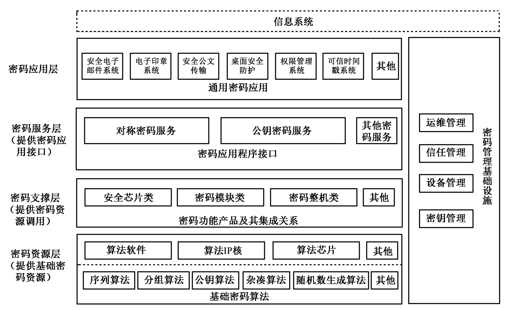

## 密码服务中台

在技术原理部分，我们已经从对称加密、非对称加密，讲到了数字信封，最后指出CA认证的作用和密钥管理重要性。这里面的逻辑是相对非对称加密，非对称加密很好的解决了双方密钥交换的问题，数字信封解决了非对称加密的效率问题，而CA确保了身份的真实性，最后指出密码系统的安全性不应依赖于对密码算法的保密，而是取决于密钥的保密。

### 典型密码应用技术框架

有了上面这些基本知识之后，我们来探讨一下一个好的密码系统怎样设计。先从一个典型的密码系统设计开始。

上面这张密码应用技术框架图，包括密码资源、密码支撑、密码服务、密码应用四个层次，以及提供管理服务的密码管理基础设施。

密码资源层提供了基础的密码算法，并以芯片或者软件的方式进行封装；密码支撑层遵循国密规范对密码模块、密码整机等方式进行再次封装为应用提供合规的密码资源（设备）；密码服务层面向业务应用提供对称加密、非对称加密等密码服务，为上层应用提供数据的机密性、完整性、身份鉴别和抗抵赖等功能；密码应用层调用密码服务层提供的密码应用接口，为应用系统提供密码应用和服务。典型的密码应用有电子印章、可信时间戳等。

在这个设计里，密码管理基础设施作为一个相对独立的组件，为上述四层提供运维管理、信任管理、设备管理和密钥管理。

典型密码应用技术框架为密码技术研发、产品研制、应用服务和管理提供了重要理论指导，为构建典型密码应用技术体系发挥了重要作用。

------

[上一章节](charpter03_seeing_cryptograpy01.md) [下一章节](charpter03_seeing_cryptograpy03.md)   