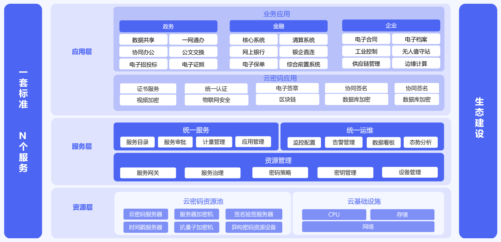

### 密码服务中台设计

经过20多年的发展，我国在密码产品标准和密码产品规范上成绩斐然，制定了7大类密码标准，已经有上百款密码机相关产品获得了商用密码产品型号，随着《中华人民共和国密码法》的颁布和《商用密码管理条例》的修订，密码行业进入到了跨越式发展阶段，以下问题需要引起大家的重视。

#### 好问题是产品设计的开始

第一，怎样统一管理密码资源？

随着关键基础设施领域对密码需求的不断增长，动辄几十台、上百台的密码设备导致密码机的管理和密钥管理变得越来越复杂比，如，在一些大型业务系统中，不同厂商设备之间的密钥怎样同步？大量密码设备怎样统一管理？等等……

第二，怎样降低业务应用对接密码的复杂度？

虽然国密局已经制定了密码应用相关的接口规范，但由于应用场景的复杂使得单一的接口形式已经无法满足业务对密码需要。

第三，怎样提高性能，降低延迟以满足金融、工业制造等复杂应用的密码服务需求？

对于金融领域，双11情况下，怎样满足业务的高并发需求；对于工业制造领域，怎样满足低延迟的需要？

第四，怎样在密码业务快速发展的同时提高密码的运维、监管能力？

密码本身作为一个重要的基础设施，在实际应用中存在很多问题。比如密码硬件设备故障，导致业务中断；业务压力过大，导致系统拒绝提供服务；密码服务异常，导致加密失败……，除了密码本身的健壮性之外，监管方需要及时了解业务应用使用密码情况以及密评情况。

第四，随着云计算、物联网、人工智能等新技术的快速发展，怎样将密码与新技术融合，进而解决新技术发展中面临的困境？

业务上云已经成为一种必然趋势，云计算“集约共享、弹性扩展、按需服务”的特点给传统靠密码设备构建的安全架构带来了新的挑战；面对物联网安全事件层出不穷的现象，物联网与密码深度融合势不可挡；面对大模型人工智能的冲击，密码怎样做好数字时代的守护者？

……

#### 设计原则

针对以上问题，我们基于典型密码应用技术框架的设计了密码服务中台，其目标是打通密码资源与业务应用之间的壁垒，建立丰富多样的密码应用生态，提升密码应用服务整体保障能力，强化密码应用运维监管能力。

典型密码应用技术框架主要是从密码的合规性视角进行设计，密码服务中台更偏向密码的应用。因此，我们将原来的密码资源层和密码支撑层统称为资源层，并引入了密码资源池的理念对密码设备进行统一管理。

**资源管理是密码服务中台的“基石”**。为了进行密码设备的统一管理，同时对应用提供便捷的密码服务接口，在密码服务中台设计里我们引入了资源管理，这里重点要处理好异构密码设备，以及业务应用需求的多样性（不同开发语言、不同技术路线、不同业务场景）。

**统一服务是密码服务中台的“门户”**。面对云计算的普及，和云原生的快速发展，云已经成了服务的代名词，这就需要密码也要适应云的要求，将密码功能以服务的方式提供给应用，同时提供一些成熟的组件和产品（VPN、电子签章、物联网网关、手机盾等）供业务使用。

**统一运维是密码服务中台的“守护神”**。密码服务中台本身也是关键基础设施，因此必须保障中台可运维和可管理。

#### 总体设计

基于上面的逻辑分析，密码服务中台架构上分为三横两纵，三横指的是密码服务中台的资源层、服务层、应用层，两纵指的是一套标准 N个服务和生态建设。

资源层涉及到云基础设施和云密码资源池，其中密码资源池包含了云密码服务器、签名验签服务器、时间戳服务器等硬件资源。

服务层是密码服务平台的亮点，包含了资源管理、统一服务和统一运维的理念。**资源管理**提供服务网关、服务治理、密码策略、密钥管理和设备管理等功能，起到了承上启下的作用——向下遵循规范兼容各厂商密码设备，使得平台有能力纳管异构厂商的设备；向上为业务应用提供统一的密码服务接口，降低业务应用的接入难度，并提供服务治理能力，确保密码服务的高可用。**统一服务**主要是面向租户提供密码服务的申请、审批和计量。**统一运维**主要从业务应用、密码资源和密码服务三方面为运维人员、主管领导提供运维监控、态势感知等相关能力，并为密码资源扩容和密码服务能力提升提供决策依据。

应用层我们分为密码应用和业务应用。为什么要将密码应用和业务应用分开来讲？从业务角度来讲，底层的密码算法要根据业务特性封装成相关密码应用才能被业务正确使用，也就是从密码算法到业务使用是两步，不是一步。密码应用的核心价值在于降低业务系统集成密码能力的难度，这里包含了证书服务、电子签章、VPN、视频加密、物联网安全、区块链等服务。业务应用指的是金融、政务、医疗、工业制造等行业应用。

一套标准指的是《密码接入指南》、《密码技术指南》等标准文档，方便第三方密码应用，以及业务系统的对接；N个服务指的是提供项目配套密码运营服务，涵盖密码咨询、密码测评、密码监管、运营保障等服务。

生态建设方面，需要构建覆盖CPU、操作系统、服务器、数据库、云基础设施、应用软件厂商的国产密码全生态体系，建设以密码基础设施为支撑的新网络安全环境，形成安全互信、开放、共享的新网络安全文明。

#### 主要功能

密码服务中台突出服务和监管，服务方面重点关注异构密码资源池化纳管、统一密码服务目录、一键申请自动开通、统一服务接口；监管方面围绕统一密码运维服务、多维度监控看板、可视化态势感知，为密码应用提供全方位的密码服务保障能力。

| 序号 | 分类     | 功能特点                         | 描述                                                         |
| ---- | -------- | -------------------------------- | ------------------------------------------------------------ |
| 1    | 密码服务 | 异构密码资源池化管理             | 对服务器密码机、云密码服务器、签名验签服务器、时间戳服务器等密码设备进行池化管理。采用密码中间件提供稳定的密码设备连接池管理和设备负载能力，同时可以通过配置异构厂商的驱动、配置文件即可进行各厂商设备的纳管；并根据《GMT 0018-2012 密码设备应用接口规范》为密码应用提供哈希、加密、解密、签名、验签、随机数等JNI接口，方便密码应用的接入 |
| 2    |          | 创新密码服务超市，实现挂表式计量 | 创新密码服务超市，用户可根据应用需求选择服务，根据用量计算费用，实现挂表式计量。节约政府开支，减少密码设备投入，实现密码资源集约化管理。信创云密码服务目录提供密码基础服务、密码增值服务和密码技术服务，其中基础服务包含机密性服务、信息完整性服务、抗抵赖服务和时间戳服务；密码增值服务包含数据加密、视频加密、物联网安全、数字证书、电子签章等服务；密码技术服务包含密评改造服务、密码接口服务和密钥托管服务。 |
| 3    |          | 一键申请，自动开通               | 采用统一的服务流程，业务单位申请，主管单位审核，运维单位审核通过，系统自动开通密码服务，最大程度降低密码服务的接入难度 |
| 4    |          | 统一服务接口                     | 为业务应用接入丰富的API接口（支持Java、Python、C++、Golang及RESTFUL接口），方便业务对接 |
| 5    |          | 基于微服务的密码开放平台         | 密码开放平台采用微服务架构，可以根据密码服务使用情况进行独立横向扩展，并为业务提供统一网关路由、鉴权、服务注册、服务治理（限流、降级、熔断）功能 |
| 6    |          | 全面融合信创                     | 支持信创CPU芯片：鲲鹏、飞腾、龙芯、海光等；支持信创操作系统：UOS统信、银河麒麟、中标麒麟等；支持信创数据库：达梦、人大金仓等 |
| 7    | 密码监管 | 统一的密码运维服务               | 通过接口方式、组件方式实时获取设备、交易、密码服务相关信息，并提供事件管理、告警预警、工单管理实现运维工作的闭环管理 |
| 8    |          | 多维度的监控看板                 | 通过监控看板面向运维人员提供交易监控、服务监控、设备监控、密钥监控，并支持下钻到详细页面，提供个性化的报表展现 |
| 9    |          | 可视化态势感知                   | 态势分析面向领导提供大屏展示，提供交易运行态势、服务运行态势和设备运行态势，为密码资源扩容和密码服务能力提升提供决策依据 |

